# FinGPT-131M: Training a GST/Tax LLM from Scratch

A decoder-only transformer (131M parameters) trained from scratch on Indian
GST regulatory text — Advance Authority Rulings, CGST circulars, and India Code acts.
Built to understand the full pipeline from raw web scraping through HF Hub publication.

**Trained model:** [Tharun007/FinGPT-131M](https://huggingface.co/Tharun007/FinGPT-131M)  
**Training corpus:** [Tharun007/gst-rulings-corpus](https://huggingface.co/datasets/Tharun007/gst-rulings-corpus)

---

## Architecture

> Full standalone diagram → [`architecture_diagram.md`](architecture_diagram.md)

```mermaid
flowchart LR
    classDef io   fill:#ffffff,stroke:#6c757d,stroke-width:1.5px,color:#212529,font-style:italic
    classDef emb  fill:#d4edda,stroke:#28a745,stroke-width:1.5px,color:#155724
    classDef drop fill:#fff3cd,stroke:#ffc107,stroke-width:1.5px,color:#856404
    classDef ln   fill:#fff3cd,stroke:#ffc107,stroke-width:1.5px,color:#856404
    classDef attn fill:#cce5ff,stroke:#004085,stroke-width:1.5px,color:#004085
    classDef ffn  fill:#f8d7da,stroke:#721c24,stroke-width:1.5px,color:#721c24
    classDef proj fill:#d4edda,stroke:#28a745,stroke-width:1.5px,color:#155724
    classDef add  fill:#e2e3e5,stroke:#6c757d,stroke-width:1px,color:#212529

    T(["TaxGPT-131M — Decoder-Only Transformer\n~131.3M params | 13 layers | 768 hidden | 12 heads | ctx 1024 | vocab 50257"])

    IN["Input Token Indices\n(Batch x Sequence)"]:::io

    subgraph EMB["  Embedding Layer  "]
        direction TB
        TE["Token Embedding\nvocab=50257 -> emb=768"]:::emb
        PE["Positional Embedding\nctx=1024 -> emb=768"]:::emb
        EADD(("+")):::add
        DE["Dropout  p=0.2"]:::drop
    end

    subgraph TRF["  Transformer Block  x13  Pre-LayerNorm  "]
        direction TB
        LN1["LayerNorm\nemb=768"]:::ln
        MHA["Multi-Head Causal Attention\nn_heads=12 head_dim=64"]:::attn
        AADD(("+")):::add
        LN2["LayerNorm\nemb=768"]:::ln
        FFN["Feed-Forward Network\nLinear 768->3072 GELU Linear 3072->768"]:::ffn
        FADD(("+")):::add
    end

    FLN["Final LayerNorm\nemb=768"]:::ln
    OP["Output Projection\nLinear 768->50257\nWeight-tied with Token Embedding"]:::proj
    OUT["Logits\n(Batch x Sequence x 50257)"]:::io

    T ~~~ IN
    IN --> TE
    IN -.->|positional indices| PE
    TE --> EADD
    PE --> EADD
    EADD --> DE
    DE --> LN1
    LN1 --> MHA
    MHA --> AADD
    LN1 -.->|residual| AADD
    AADD --> LN2
    LN2 --> FFN
    FFN --> FADD
    AADD -.->|residual| FADD
    FADD -->|loop x13| FLN
    FLN --> OP
    OP --> OUT
```



---

## Project Structure

| Stage | Folder | What It Does |
|---|---|---|
| 1 | [`01_data-collection/`](01_data-collection/) | Scrapers for gstcouncil.gov.in Advance Authority Rulings (PDFs, 3,071 records across 308 pages) and India Code acts/circulars/notifications. Each scraper locates table columns by header text, not fixed index, and handles resumable pagination. |
| 2 | [`02_corpus-extraction/`](02_corpus-extraction/) | Five-stage pipeline (extract → clean → dedup → tokenize → split) that turns raw PDFs/HTML into a stratified train/val JSONL corpus. Deduplication uses minhash; split is whole-document to avoid token leakage. |
| 3 | [`03_dataset-publishing/`](03_dataset-publishing/) | Packs the JSONL corpus into fixed-length token sequences (context_length=1024) using GPT-2 BPE and publishes a per-document HuggingFace `DatasetDict` to the Hub for reuse and inspection. |
| 4 | [`04_model-architecture/`](04_model-architecture/) | Decoder-only GPT-2-style transformer: 13 layers, 768 hidden, 12 heads, ~131.3M parameters. Uses `scaled_dot_product_attention` (causal), GELU activation, weight-tied embeddings, and pre-norm LayerNorm. One layer deeper than GPT-2 small to hit the 130M target. |
| 5 | [`05_training/`](05_training/) | FP16 mixed-precision training loop with gradient accumulation (effective batch = 8), activation checkpointing, AdamW (lr=3e-4, wd=0.1), early stopping (patience=10), and AMP-aware checkpoint saving/resuming. Best result: val_loss 2.7641 at step 11,250 on Kaggle T4. |
| 6 | [`06_export-to-huggingface/`](06_export-to-huggingface/) | Converts the raw PyTorch checkpoint to a `PreTrainedModel` subclass (`FinGPTForCausalLM`) with a custom config class (`FinGPTConfig`), exports to `safetensors`, tests generation locally, and uploads to the HF Hub. See the bonus debugging postmortem for the tied-weight export bug. |
| 7 | [`07_evaluation/`](07_evaluation/) | Qualitative generation test across 10 prompts (in-domain GST/tax text at multiple temperatures + two off-domain controls) to check coherence, repetition, and domain specificity. |

---

## Quick Start

```bash
# Install dependencies
pip install -r requirements.txt

# Generate text with the trained model
from transformers import AutoTokenizer
from fingpt-131m-project.06_export-to-huggingface.01_main-chapter-code.configuration_fingpt import FinGPTConfig
from fingpt-131m-project.06_export-to-huggingface.01_main-chapter-code.modeling_fingpt import FinGPTForCausalLM
import torch

model = FinGPTForCausalLM.from_pretrained("Tharun007/FinGPT-131M", trust_remote_code=True)
tokenizer = AutoTokenizer.from_pretrained("openai-community/gpt2")

inputs = tokenizer("Input Tax Credit can be claimed when", return_tensors="pt")
with torch.no_grad():
    out = model.generate(**inputs, max_new_tokens=80, do_sample=True, temperature=0.8, top_k=50)
print(tokenizer.decode(out[0], skip_special_tokens=True))
```

---

## Data

Raw PDFs and processed JSONL files are **not tracked** in this repo (see `.gitignore`) —
they are large and reproducible from the pipeline. See [`data/README.md`](data/README.md)
for instructions to regenerate locally, or use the published HF dataset directly.

---

## Model Card Summary

| Property | Value |
|---|---|
| Parameters | ~131.3M |
| Architecture | Decoder-only transformer (GPT-2 style) |
| Layers / Heads / Hidden | 13 / 12 / 768 |
| Context length | 1,024 tokens |
| Tokenizer | GPT-2 BPE (50,257 vocab) |
| Training data | GST Advance Rulings + India Code acts/circulars |
| Best val loss | 2.7641 (step 11,250) |
| Training hardware | Kaggle T4 GPU (FP16) |
