# TaxGPT-131M Architecture Diagram

> Generated using [Mermaid](https://mermaid.js.org/) flowchart — landscape orientation.
> **No code execution required** — renders natively in GitHub, VS Code, and most Markdown viewers.

```mermaid
flowchart LR
    %% ── Styles ──────────────────────────────────────────────────────────────
    classDef io       fill:#ffffff,stroke:#6c757d,stroke-width:1.5px,color:#212529,font-style:italic
    classDef emb      fill:#d4edda,stroke:#28a745,stroke-width:1.5px,color:#155724
    classDef drop     fill:#fff3cd,stroke:#ffc107,stroke-width:1.5px,color:#856404
    classDef ln       fill:#fff3cd,stroke:#ffc107,stroke-width:1.5px,color:#856404
    classDef attn     fill:#cce5ff,stroke:#004085,stroke-width:1.5px,color:#004085
    classDef ffn      fill:#f8d7da,stroke:#721c24,stroke-width:1.5px,color:#721c24
    classDef proj     fill:#d4edda,stroke:#28a745,stroke-width:1.5px,color:#155724
    classDef add      fill:#e2e3e5,stroke:#6c757d,stroke-width:1px,color:#212529
    classDef title    fill:none,stroke:none,color:#212529

    %% ── Title ────────────────────────────────────────────────────────────────
    T(["TaxGPT-131M — Decoder-Only Transformer\n~131.3M params | 13 layers | 768 hidden | 12 heads | ctx 1024 | vocab 50257"]):::title

    %% ── Input ────────────────────────────────────────────────────────────────
    IN["Input Token Indices\n(Batch x Sequence)"]:::io

    %% ── Embedding Layer ──────────────────────────────────────────────────────
    subgraph EMB["  Embedding Layer  "]
        direction TB
        TE["Token Embedding\nvocab=50257 -> emb=768"]:::emb
        PE["Positional Embedding\nctx=1024 -> emb=768"]:::emb
        EADD(("+")):::add
        DE["Dropout  p=0.2"]:::drop
    end

    %% ── Transformer Block x13 ────────────────────────────────────────────────
    subgraph TRF["  Transformer Block  x13  Pre-LayerNorm  "]
        direction TB
        LN1["LayerNorm\nemb=768"]:::ln
        MHA["Multi-Head Causal Attention\nn_heads=12 head_dim=64\nscaled_dot_product_attention"]:::attn
        AADD(("+")):::add
        LN2["LayerNorm\nemb=768"]:::ln
        FFN["Feed-Forward Network\nLinear 768->3072 GELU Linear 3072->768"]:::ffn
        FADD(("+")):::add
    end

    %% ── Output Head ─────────────────────────────────────────────────────────
    FLN["Final LayerNorm\nemb=768"]:::ln
    OP["Output Projection\nLinear 768->50257\nWeight-tied with Token Embedding"]:::proj
    OUT["Logits\n(Batch x Sequence x 50257)"]:::io

    %% ── Edges ────────────────────────────────────────────────────────────────
    T ~~~ IN

    IN --> TE
    IN -.->|positional indices| PE
    TE --> EADD
    PE --> EADD
    EADD --> DE

    DE --> LN1
    LN1 --> MHA
    MHA --> AADD
    LN1 -.->|residual| AADD

    AADD --> LN2
    LN2 --> FFN
    FFN --> FADD
    AADD -.->|residual| FADD

    FADD -->|loop x13| FLN
    FLN --> OP
    OP --> OUT
```

---

### Legend

| Colour | Component |
|--------|-----------|
| Green  | Embedding and projection layers |
| Yellow | Normalization and dropout |
| Blue   | Attention sub-block |
| Red    | Feed-Forward sub-block |
| Grey   | Add residual sum nodes |

> **Dashed arrows** = residual (skip) connections.
> **Solid arrows** = primary data flow.
